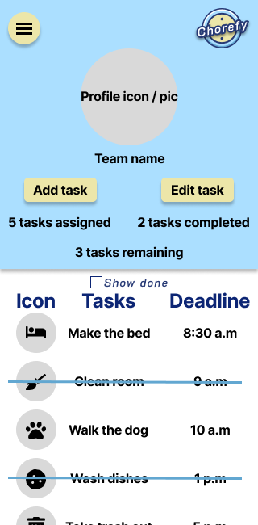
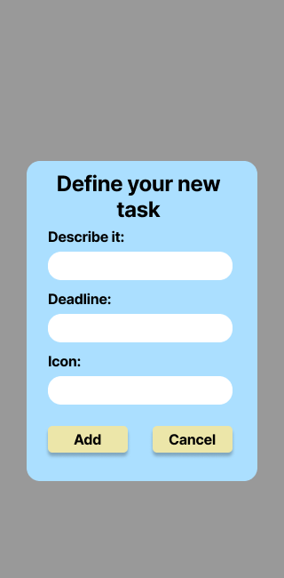
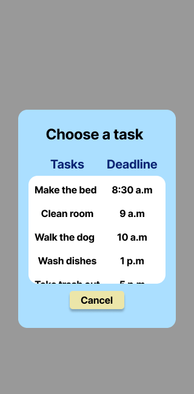
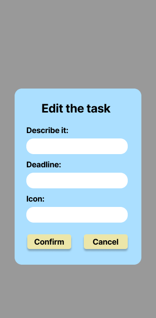

<h1 align="center">
    
</h1>

# Chorefy
Chorefy is a web application inteded to help people who live together manage and assign their daily chores fast and easy.

## 

# Table of contents
1. [Technology choices](#technology-choices)
2. [Design](#design)
3. [Getting started](#getting-started)

# Technology choices
HTML

CSS

Javascript

Firebase

# Design
The design was entirely made using Figma.

Most of the icons are from FontAwesome plugin and some images were made using AI text to image.

## Brand / Loading Page
<h1 align="center">
    
</h1>

## Main Page
<h1 align="center">
    
</h1>

## Add Task Modal
<h1 align="center">
    
</h1>

## Edit Task Choice Modal
<h1 align="center">
    
</h1>

## Edit Chosen Task Modal
<h1 align="center">
    
</h1>